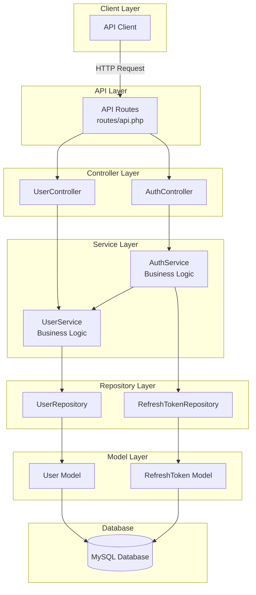
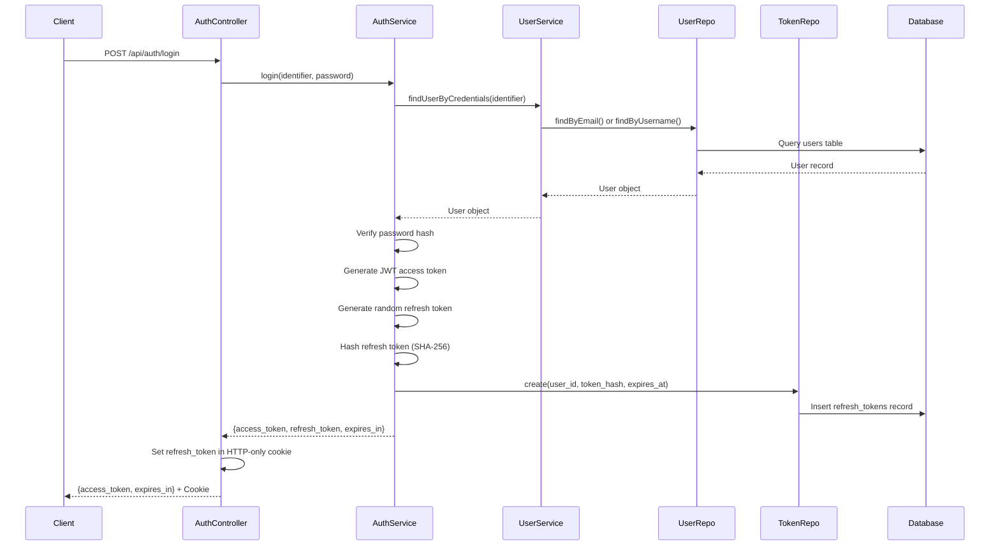
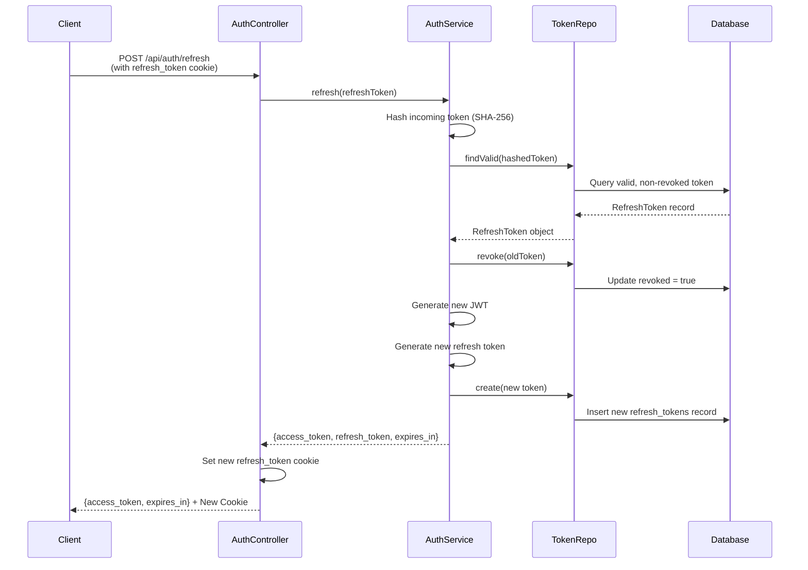

# ULS Architecture Documentation

## Overview

The Unified Login Service (ULS) is a centralized authentication service built on Laravel 11, implementing JWT-based authentication with secure refresh token rotation. The architecture follows a clean, layered design pattern that promotes separation of concerns, testability, and maintainability.

## Architecture Diagram



## Layered Architecture

The ULS follows a **4-tier layered architecture** pattern:

### 1. Controller Layer
**Location:** `app/Http/Controllers/`

**Responsibilities:**
- Handle HTTP requests and responses
- Validate incoming request data
- Delegate business logic to services
- Format responses (JSON)
- Manage HTTP-only cookies for refresh tokens

**Components:**
- **AuthController**: Manages authentication endpoints (login, refresh, logout)
- **UserController**: Manages user-related endpoints (create user, change password)

### 2. Service Layer
**Location:** `app/Services/`

**Responsibilities:**
- Implement core business logic
- Orchestrate operations across multiple repositories
- Handle JWT generation and validation
- Implement security features (token rotation, hashing)

**Components:**
- **AuthService**: 
  - Handles login authentication
  - Generates JWT access tokens and opaque refresh tokens
  - Implements refresh token rotation
  - Manages logout operations
  
- **UserService**:
  - Creates new users
  - Validates credentials
  - Handles password changes
  - Finds users by email or username

### 3. Repository Layer
**Location:** `app/Repositories/`

**Responsibilities:**
- Abstract database operations
- Provide clean interface for data access
- Implement query logic
- Follow repository pattern for testability

**Components:**
- **UserRepository**: CRUD operations for users
- **RefreshTokenRepository**: Manages refresh token lifecycle

**Interfaces:**
- `UserRepositoryInterface`
- `RefreshTokenRepositoryInterface`

### 4. Model Layer
**Location:** `app/Models/`

**Responsibilities:**
- Define database schema mappings
- Implement Eloquent relationships
- Handle data casting and transformations

**Components:**
- **User Model**: Represents authenticated users with UUID primary keys
- **RefreshToken Model**: Stores hashed refresh tokens with expiration

---

## Data Flow

### Authentication Flow



### Token Refresh Flow



---

## Component Details

### Controllers

#### AuthController
**File:** `app/Http/Controllers/AuthController.php`

**Methods:**
- `login(Request)`: Authenticates user and returns tokens
- `refresh(Request)`: Rotates refresh token and issues new access token
- `logout(Request)`: Revokes refresh token
- `createRefreshTokenCookie(string)`: Helper to create secure HTTP-only cookies

**Security Features:**
- HTTP-only cookies for refresh tokens
- Configurable cookie domain, secure flag, and SameSite policy
- Token removal from response body

#### UserController
**File:** `app/Http/Controllers/UserController.php`

**Methods:**
- `create(Request)`: Creates new user account
- `changePassword(Request)`: Updates user password with validation

---

### Services

#### AuthService
**File:** `app/Services/AuthService.php`

**Dependencies:**
- `RefreshTokenRepositoryInterface`
- `UserService`
- Firebase JWT library

**Configuration:**
- `JWT_SECRET`: Secret key for signing JWTs
- `JWT_ALGO`: Algorithm (default: HS256)
- `JWT_ACCESS_TTL`: Access token lifetime in seconds (default: 900 = 15 min)
- `JWT_REFRESH_TTL`: Refresh token lifetime in seconds (default: 2592000 = 30 days)

**Key Methods:**
- `login(identifier, password)`: Validates credentials and generates tokens
- `refresh(refreshToken)`: Implements token rotation
- `logout(refreshToken)`: Revokes token
- `generateTokens(User)`: Creates JWT and opaque refresh token

**Security Implementation:**
- JWT payload includes: `sub` (user ID), `iss` (issuer), `iat` (issued at), `exp` (expiration)
- Refresh tokens are 64-character random strings
- Tokens are hashed with SHA-256 before storage
- Automatic token rotation on refresh

#### UserService
**File:** `app/Services/UserService.php`

**Dependencies:**
- `UserRepositoryInterface`

**Methods:**
- `createUser(array)`: Creates user with hashed password
- `changePassword(userId, currentPassword, newPassword)`: Validates and updates password
- `findUserByCredentials(identifier)`: Finds user by email or username

---

### Repositories

#### UserRepository
**File:** `app/Repositories/UserRepository.php`

**Interface:** `UserRepositoryInterface`

**Methods:**
- `create(array)`: Create new user
- `findByEmail(string)`: Find user by email
- `findByUsername(string)`: Find user by username
- `findById(string)`: Find user by UUID
- `updatePassword(User, string)`: Update user password

#### RefreshTokenRepository
**File:** `app/Repositories/RefreshTokenRepository.php`

**Interface:** `RefreshTokenRepositoryInterface`

**Methods:**
- `create(array)`: Store new refresh token
- `findByToken(string)`: Find token by hash
- `findValid(string)`: Find valid, non-revoked, non-expired token
- `revoke(RefreshToken)`: Mark token as revoked
- `revokeAllForUser(string)`: Revoke all tokens for a user

---

### Models

#### User Model
**File:** `app/Models/User.php`

**Table:** `users`

**Key Features:**
- UUID primary key (using `HasUuids` trait)
- Password auto-hashing via `hashed` cast
- Relationship: `hasMany(RefreshToken)`

**Attributes:**
- `id` (UUID, primary key)
- `username` (nullable, unique)
- `email` (required, unique)
- `password` (hashed)
- `created_at`, `updated_at`

#### RefreshToken Model
**File:** `app/Models/RefreshToken.php`

**Table:** `refresh_tokens`

**Key Features:**
- No timestamps (`$timestamps = false`)
- Relationship: `belongsTo(User)`

**Attributes:**
- `id` (auto-increment)
- `user_id` (UUID, foreign key)
- `token_hash` (SHA-256 hash)
- `revoked` (boolean)
- `expires_at` (datetime)

---

## API Routes

**File:** `routes/api.php`

### Authentication Endpoints
```
POST /api/auth/login       - Authenticate user
POST /api/auth/refresh     - Refresh access token
POST /api/auth/logout      - Logout user
```

### User Management Endpoints
```
POST /api/users                  - Create new user
POST /api/users/change-password  - Change user password
```

---

## Security Features

### 1. Token Security
- **JWT Access Tokens**: Short-lived (15 minutes default), stateless
- **Opaque Refresh Tokens**: Long-lived (30 days default), stored hashed
- **SHA-256 Hashing**: All refresh tokens hashed before database storage
- **Token Rotation**: Refresh tokens are single-use and rotated on each refresh

### 2. Cookie Security
- **HTTP-only**: Prevents JavaScript access to refresh tokens
- **Configurable Secure Flag**: HTTPS-only in production
- **SameSite Policy**: Configurable (default: lax)
- **Path Restriction**: Cookies scoped to `/api/auth`

### 3. Password Security
- **Bcrypt Hashing**: Automatic via Laravel's `hashed` cast
- **Current Password Validation**: Required for password changes

### 4. Database Security
- **Prepared Statements**: Eloquent ORM prevents SQL injection
- **UUID Primary Keys**: Non-sequential, harder to enumerate

---

## Dependency Injection

The application uses Laravel's service container for dependency injection:

**Service Provider:** `app/Providers/AppServiceProvider.php`

**Bindings:**
```php
$this->app->bind(UserRepositoryInterface::class, UserRepository::class);
$this->app->bind(RefreshTokenRepositoryInterface::class, RefreshTokenRepository::class);
```

**Benefits:**
- Loose coupling between layers
- Easy testing with mock implementations
- Centralized dependency configuration

---

## Configuration

### Environment Variables

**JWT Configuration:**
```env
JWT_SECRET=your-secret-key
JWT_ALGO=HS256
JWT_ACCESS_TTL=900        # 15 minutes
JWT_REFRESH_TTL=2592000   # 30 days
```

**Cookie Configuration:**
```env
COOKIE_DOMAIN=null
COOKIE_SECURE=false       # Set to true in production with HTTPS
COOKIE_SAME_SITE=lax
```

**Database:**
```env
DB_CONNECTION=mysql
DB_HOST=127.0.0.1
DB_PORT=3306
DB_DATABASE=uls
DB_USERNAME=root
DB_PASSWORD=
```

---

## Database Schema

### Users Table
```sql
CREATE TABLE users (
    id CHAR(36) PRIMARY KEY,
    username VARCHAR(255) UNIQUE,
    email VARCHAR(255) UNIQUE NOT NULL,
    password VARCHAR(255) NOT NULL,
    created_at TIMESTAMP,
    updated_at TIMESTAMP
);
```

### Refresh Tokens Table
```sql
CREATE TABLE refresh_tokens (
    id BIGINT AUTO_INCREMENT PRIMARY KEY,
    user_id CHAR(36) NOT NULL,
    token_hash VARCHAR(255) NOT NULL,
    revoked BOOLEAN DEFAULT FALSE,
    expires_at TIMESTAMP NOT NULL,
    FOREIGN KEY (user_id) REFERENCES users(id) ON DELETE CASCADE,
    INDEX idx_token_hash (token_hash),
    INDEX idx_user_id (user_id)
);
```

---

## Design Patterns

### 1. Repository Pattern
Abstracts data access logic, making the codebase more testable and maintainable.

### 2. Service Layer Pattern
Encapsulates business logic, keeping controllers thin and focused on HTTP concerns.

### 3. Dependency Injection
Promotes loose coupling and enables easy testing with mock objects.

### 4. Interface Segregation
Repositories implement interfaces, allowing for multiple implementations and easy mocking.

---

## Testing Strategy

### Unit Tests
- Test services in isolation with mocked repositories
- Test repositories with in-memory database
- Test models for relationships and casts

### Integration Tests
- Test complete authentication flows
- Test token refresh and rotation
- Test error handling and edge cases

### API Tests
- Test all endpoints with various payloads
- Test authentication middleware
- Test cookie handling

---

## Future Enhancements

### Potential Improvements
1. **Token Reuse Detection**: Revoke all user tokens if revoked token is reused
2. **Rate Limiting**: Prevent brute force attacks on login endpoint
3. **Email Verification**: Verify email addresses before allowing login
4. **Multi-Factor Authentication**: Add TOTP or SMS-based 2FA
5. **OAuth Integration**: Support social login providers
6. **Token Blacklisting**: Redis-based JWT blacklist for immediate revocation
7. **Audit Logging**: Track all authentication events
8. **Session Management**: Allow users to view and revoke active sessions

---

## Troubleshooting

### Common Issues

**Issue: JWT_SECRET not set**
- Ensure `.env` file contains `JWT_SECRET` with a strong random value

**Issue: Refresh token not found**
- Check that cookies are being sent with requests
- Verify cookie domain and path configuration

**Issue: Token expired**
- Check system time synchronization
- Verify `JWT_ACCESS_TTL` and `JWT_REFRESH_TTL` values

**Issue: Database connection failed**
- Verify database credentials in `.env`
- Ensure MySQL service is running
- Run migrations: `php artisan migrate`

---

## References

- [Laravel Documentation](https://laravel.com/docs)
- [Firebase PHP-JWT](https://github.com/firebase/php-jwt)
- [JWT Best Practices](https://tools.ietf.org/html/rfc8725)
- [OWASP Authentication Cheat Sheet](https://cheatsheetseries.owasp.org/cheatsheets/Authentication_Cheat_Sheet.html)
